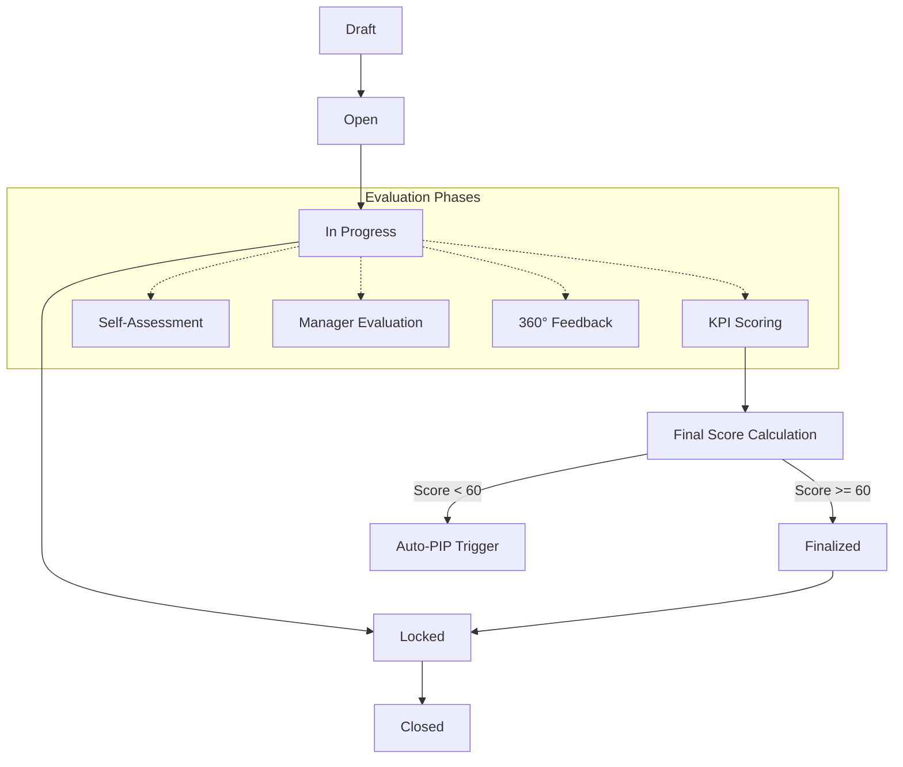
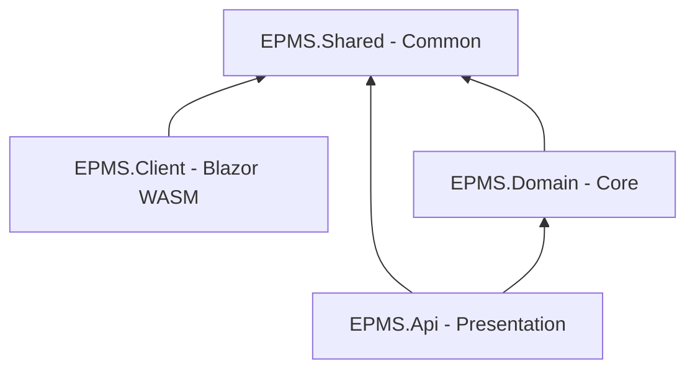

# EPMS - Employee Performance Management System

[](https://dotnet.microsoft.com/download)
[](#architecture-overview)
[](#license)

**EPMS (Employee Performance Management System)** is a strategic talent development platform designed to transition organizational performance management from manual processes to an intelligent, data-driven ecosystem. Built on a dynamic **Position-Based Access Control (PBAC)** model, the system aligns individual goals with organizational objectives while ensuring transparency, fairness, and continuous growth.

---

## Business Context & Purpose

The core mission of EPMS is to foster a high-performance culture by providing a transparent platform where Performance Criteria (KPIs) and functional permissions are clearly visible based on organizational positions.

### Key Organizational Structures
- **Three Core Roles**: System Admin, Admin, and User.
- **Position Levels (L01–L09)**: Hierarchical levels governing both evaluation weightage and system permissions.
- **Ownership Logic**: Secure data visibility restricted to Department/Team levels.
- **PBAC Model**: Dynamic permissioning where capabilities are tied to the employee's position and department.

---

## Appraisal Lifecycle & Workflow

The system enforces a strict state machine to manage the appraisal lifecycle, ensuring data integrity and process compliance.



---

## Architecture Overview

EPMS follows **Clean Architecture** principles, ensuring a decoupled, testable, and maintainable codebase.



### Solution Components
- **EPMS.Api**: ASP.NET Core Web API. Handles HTTP requests, authentication, and orchestrates application services.
- **EPMS.Domain**: The heart of the system. Contains entities, business logic, service implementations, and data access abstractions (Repositories/Unit of Work).
- **EPMS.Shared**: A common library containing DTOs, FluentValidation rules, constants, and enums used across both API and Client.
- **EPMS.Client**: A Blazor WebAssembly frontend (currently in scaffolding phase) providing the user interface.

---

## Tech Stack

| Technology | Version | Purpose |
| :--- | :--- | :--- |
| **.NET** | 9.0 | Core Framework |
| **EF Core** | 9.0.0 | Object-Relational Mapper (SQL Server) |
| **JWT Bearer** | 9.0.2 | Secure Authentication |
| **AutoMapper** | 16.1.1 | Object-to-Object Mapping |
| **FluentValidation** | 11.11.0 | Robust Input Validation |
| **BCrypt.Net** | 4.0.3 | Password Hashing |
| **Scrutor** | 6.0.1 | Assembly Scanning for DI |
| **MudBlazor** | 7.x | Component Library (Client) |

---

## Module Overview

| Module | Description |
| :--- | :--- |
| **Auth** | Identity management, JWT/Refresh tokens, PBAC, and Role-based security. |
| **HR** | Organizational mapping (Departments, Levels, Positions, Teams). |
| **EmployeeInfo** | Comprehensive profiles including employment history, contact, and payroll. |
| **Performance** | Core engine for Appraisals, KPI management, 360° Feedback, and PIPs. |
| **Shared** | Cross-cutting concerns: Categories, Tags, and Document Attachments. |

### Business Rules (BR) Summary
- **BR-01 (Score Weighting)**: Mandatory distribution: 50% KPI / 25% Manager / 15% 360 Feedback / 10% Self.
- **BR-02 (Mandatory PIP Trigger)**: Automatic system flag for any final score below **60.00**.
- **BR-03 (Data Integrity)**: Automatic **Read-Only Lock** on forms immediately following the submission deadline.

---

## Setup & Run Instructions

### Prerequisites
- .NET 9.0 SDK
- SQL Server (LocalDB or Express)
- Visual Studio 2022 or VS Code

### Backend (API)
1.  **Restore Packages**: `dotnet restore`
2.  **Database Setup**:
    - Update connection string in `EPMS.Api/appsettings.json`.
    - Apply migrations: `dotnet ef database update --project EPMS.Domain --startup-project EPMS.Api`
3.  **Run API**: `dotnet run --project EPMS.Api`
4.  **API Docs**: Access Swagger UI at `https://localhost:xxxx/swagger`.

### Frontend (Client)
1.  **Configure API URL**: Update `ApiBaseUrl` in `EPMS.Client/wwwroot/appsettings.json`.
2.  **Run Client**: `dotnet run --project EPMS.Client`

---

## Coding Conventions

### The Auth Pattern
The project follows a standardized response and error-handling pattern:
- **Services**: Return `Task<SuccessResponse<T>>`. No exceptions for business logic errors.
- **Controllers**: Inherit from `ApiControllerBase` and use `HandleResult()` to map responses to HTTP status codes.
- **DTOs**: Suffixed with `Request`, `Response`, or `Dto`.

**Example Service Implementation:**
```csharp
public async Task<SuccessResponse<LevelDto>> GetByIdAsync(long id)
{
    var level = await _uow.HR.Levels.GetByIdAsync(id);
    if (level is null)
        return SuccessResponse<LevelDto>.Fail("Level not found", ErrorType.NotFound);
        
    return SuccessResponse<LevelDto>.Ok(_mapper.Map<LevelDto>(level), "Success");
}
```

---

## License
Placeholder - [MIT License](LICENSE)
